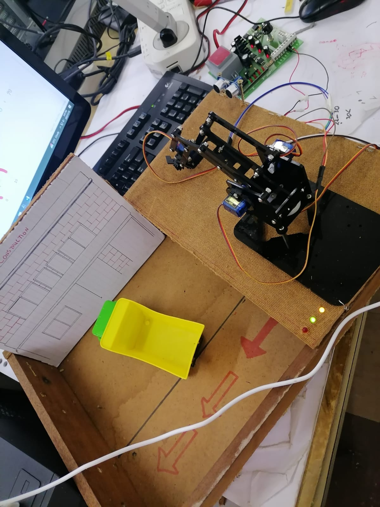
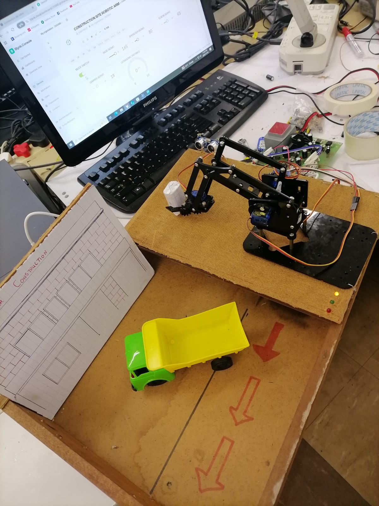
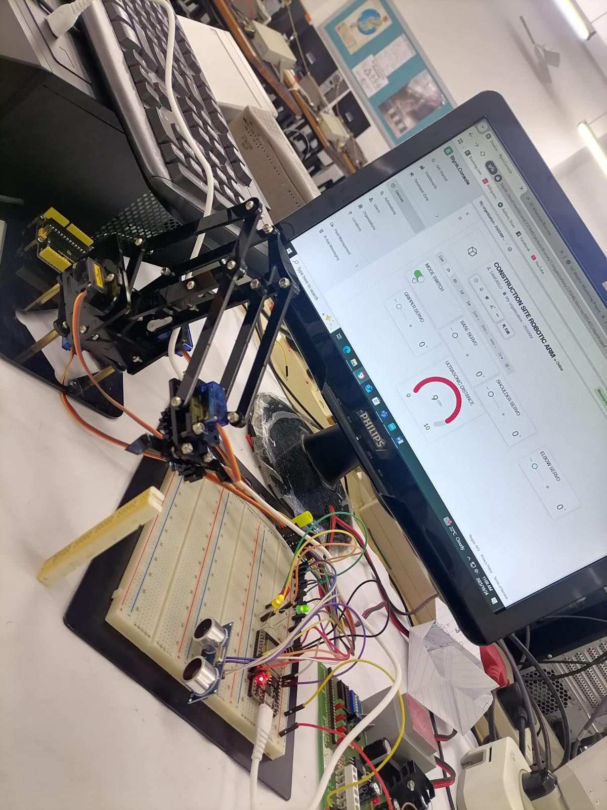
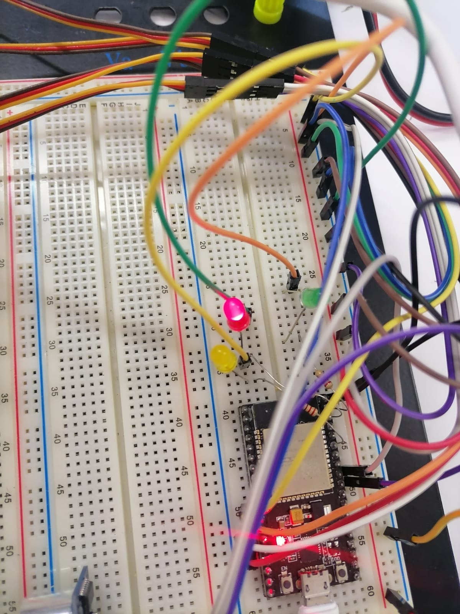
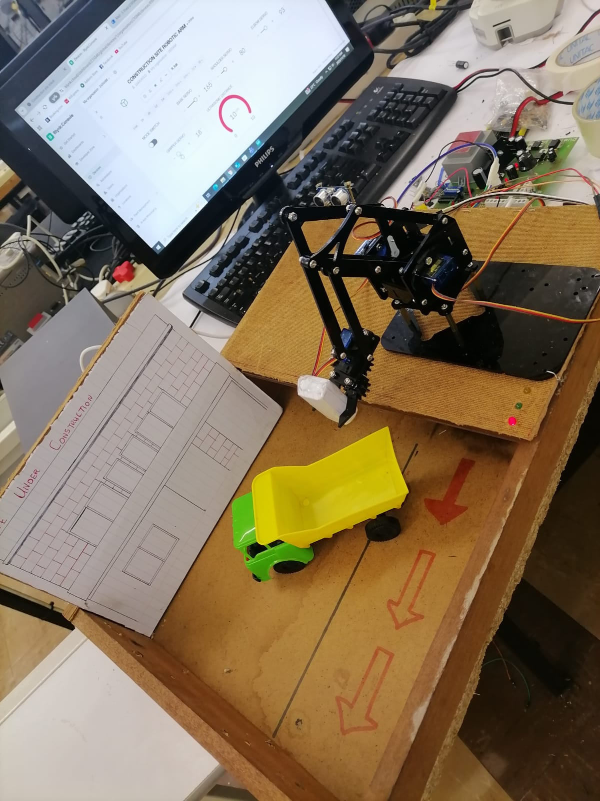
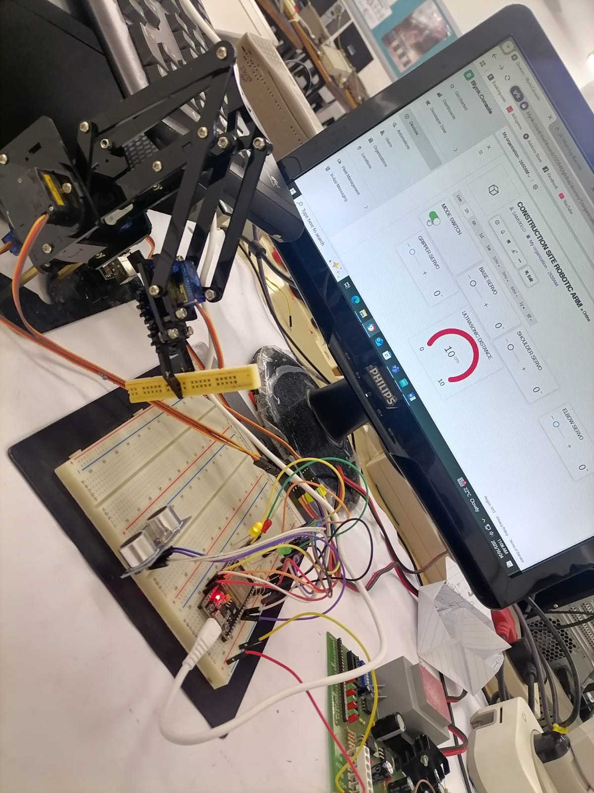

# Construction Site Robotic Arm

## 1. Project Overview

An individual second-semester Electronic and Computer Engineering project focused on developing a robotic arm prototype for construction-site automation.

The system uses an ESP32 microcontroller to control a multi-servo robotic arm capable of detecting, picking and placing objects, with the aim of demonstrating automated material-handling applications in construction environments.

## 2. Objective

The project aims to explore how embedded systems, robotics, sensors and wireless control can be integrated to automate repetitive material-handling tasks in construction environments.

## 3. Technologies and Components

- ESP32 microcontroller
- HC-SR04 ultrasonic sensor
- SG90 servo motors
- Robotic arm mechanism
- Servo-controlled gripper
- Blynk IoT platform
- External 5V servo power supply

## 4. System Features

- Object detection using an ultrasonic sensor
- Robotic arm movement using multiple servo motors
- Automated object picking and placement
- Servo-controlled gripper
- Manual control through a wireless interface
- ESP32-based embedded control
- Demonstration of construction automation concepts

## 5. Servo Configuration

- Base servo: GPIO 13
- Shoulder servo: GPIO 12
- Elbow servo: GPIO 14
- Gripper servo: GPIO 27
- Ultrasonic trigger: GPIO 5
- Ultrasonic echo: GPIO 18

 ## 6. My Role

This was an individual project completed during my second semester of Electronic and Computer Engineering.

I was responsible for the project concept, system design, hardware integration, programming, testing, troubleshooting and demonstration of the robotic arm.

## 7. Engineering Skills Demonstrated

- Embedded Systems
- ESP32 Programming
- Robotics
- Servo Motor Control
- Sensor Integration
- IoT and Wireless Control
- Hardware Integration
- Automation
- System Troubleshooting
- Construction Technology Applications

## 8. Project Significance

The project demonstrates the application of Electronic and Computer Engineering in construction automation by combining embedded systems, robotics, sensing and wireless technologies to explore automated material handling. 

## 9. How the System Works

The Construction Site Robotic Arm operates by integrating sensing, wireless communication, embedded control and servo-based actuation.

The ESP32 functions as the main controller of the system. It receives control commands through the wireless interface and processes these commands to control the individual servo motors responsible for the movement of the robotic arm.

An HC-SR04 ultrasonic sensor is used for object detection and distance measurement. The robotic arm uses multiple servo motors to control the base, shoulder, elbow and gripper mechanisms.

The overall operating sequence consists of:

1. Detecting or identifying the construction material.
2. Positioning the robotic arm towards the material.
3. Moving the robotic arm to the required position.
4. Activating the gripper to grasp the material.
5. Lifting and transporting the material.
6. Positioning the material at the desired location.
7. Releasing the material using the gripper.

This demonstrates how embedded systems, sensing, wireless communication and robotic actuation can be integrated into an automated construction application.

## 10. System Architecture

The system is based on an ESP32 microcontroller that coordinates sensing, wireless communication, decision-making and robotic movement.

The main system architecture consists of the following components:

- **ESP32 Microcontroller:** Central control unit responsible for processing sensor information, receiving commands and controlling the robotic arm.
- **HC-SR04 Ultrasonic Sensor:** Used for distance measurement and object detection. The sensor provides feedback to the ESP32 to determine when an object is within the required detection range.
- **Servo Motors:** Control the movement of the robotic arm, including the base, shoulder, elbow and gripper.
- **Wireless Communication:** Enables remote interaction and control of the robotic arm.
- **Blynk Platform:** Provides the user interface for sending control commands and interacting with the robotic arm.
- **External Power Supply:** Provides the required power for the servo motors to ensure stable operation.

### Automatic Pick-and-Place Process

The ultrasonic sensor is integrated into the automatic pick-and-place process. The sensor continuously measures the distance to the target object and provides feedback to the ESP32.

When an object is detected within the defined distance range, the ESP32 initiates the programmed sequence of robotic movements. The servo motors then coordinate the positioning of the arm, gripping of the object, movement to the designated location and release of the object.

The general system flow is:

**HC-SR04 Sensor → ESP32 → Decision Making → Servo Control → Robotic Arm Movement**

Wireless commands through the Blynk interface provide an additional method of interacting with the system.

The ESP32 therefore serves as the central interface between the sensing system, software control logic and physical robotic mechanism, enabling an automated construction-material handling process.

## 11. Circuit and Wiring

The robotic arm uses an ESP32 as the main control unit. The ESP32 interfaces with the servo motors, HC-SR04 ultrasonic sensor and status LEDs.

### GPIO Configuration

| Component | ESP32 GPIO | Function |
|---|---:|---|
| Base Servo | GPIO 13 | Controls base rotation |
| Shoulder Servo | GPIO 12 | Controls shoulder movement |
| Elbow Servo | GPIO 14 | Controls elbow movement |
| Gripper Servo | GPIO 27 | Controls gripper opening and closing |
| HC-SR04 Trigger | GPIO 5 | Sends ultrasonic trigger pulse |
| HC-SR04 Echo | GPIO 18 | Receives ultrasonic echo |
| Auto Mode LED | GPIO 21 | Indicates automatic mode |
| Manual Mode LED | GPIO 22 | Indicates manual mode |
| Brick Detection LED | GPIO 23 | Indicates object detection |

### Power and Control

The ESP32 provides the control signals for the servo motors and sensor interfaces, while an external 5 V supply is used for the servo motors.

The servo motors are connected to the robotic arm's base, shoulder, elbow and gripper mechanisms. The HC-SR04 provides distance measurements to the ESP32, which uses the measured distance as part of the automatic pick-and-place decision process.

The system also uses three LEDs to provide visual feedback for the operating mode and object detection status.

## 12. Software and Source Code

The robotic arm is programmed using the Arduino development environment with the ESP32 as the main microcontroller.

The software integrates wireless communication, sensor processing, servo control, operating-mode selection and the automatic pick-and-place sequence.

### Main Software Functions

- ESP32-based embedded control
- Blynk wireless communication
- Manual and automatic operating modes
- Servo motor control
- HC-SR04 distance measurement
- Automatic object detection
- Automatic pick-and-place sequence
- Real-time distance monitoring through the Blynk interface
- LED status indication

### Blynk Control

The Blynk interface is used to interact with the robotic arm remotely.

| Virtual Pin | Function |
|---|---|
| V0 | Automatic / Manual mode selection |
| V1 | Base servo control |
| V2 | Shoulder servo control |
| V3 | Elbow servo control |
| V4 | Gripper servo control |
| V5 | Distance monitoring |

### Source Code

The complete ESP32 source code is available in the `src` directory:

[View the ESP32 Source Code](./src/robotic_arm.ino)

## 13. Project Documentation

The following documents provide additional technical and presentation material for the project:

- 📄 [Final Project Report](./docs/GrpC_SheziSN_Final%20Report.pdf)
- 📊 [Project Presentation](./docs/GrpC_SheziSN_Final%20Pres.pdf) 
  
## 14. Project Photographs

The following photographs document the construction, integration, testing, and final configuration of the Construction-Site Robotic Arm prototype.

### Complete System Integration

*Complete Construction-Site Robotic Arm Prototype With Blynk-Based Wireless Control Interface And Integrated Ultrasonic Distance Sensing.*

### Embedded Control Circuit

*ESP32-Based Control Circuit With Status LEDs, Ultrasonic Sensor Connections, And Servo Control Wiring.*

### Wireless Control And Robotic Arm

*Robotic Arm Positioned Within The Construction-Site Prototype, With The Blynk Interface Used For Wireless Monitoring And Control.*

### Construction-Site Prototype

*Integrated Robotic Arm Prototype Demonstrating The Construction-Site Layout, Material Handling Area, And Wireless Control Interface.*

### Robotic Arm Assembly

*Robotic Arm Mounted On The Prototype Construction Platform With Ultrasonic Object Detection And Blynk-Based Wireless Control.*

### Final Prototype Configuration

*Construction-Site Robotic Arm Prototype Showing The Manipulator, Ultrasonic Sensor, Status Indicators, And Material Placement Area.* 

## 15. Challenges and Solutions

Several technical and practical challenges were encountered during the development of the robotic arm. These challenges provided valuable opportunities for troubleshooting, system optimisation and engineering problem-solving.

### Servo Control and Movement

**Challenge:**  
Achieving reliable and coordinated movement of multiple servo motors while maintaining accurate positioning.

**Solution:**  
The servo motors were individually configured and tested to determine suitable operating positions and movement ranges. The control logic was adjusted to coordinate the base, shoulder, elbow and gripper movements.

### Power Supply and Servo Stability

**Challenge:**  
Multiple servo motors can draw significant current, particularly during simultaneous movement, which can result in unstable operation or servo jitter.

**Solution:**  
An external 5 V supply was used for the servo motors, while the ESP32 was used as the control unit. This separated the servo power demand from the microcontroller supply.

### Ultrasonic Sensor Integration
**Challenge:**  
The robotic arm required reliable distance detection to determine when an object was within the operating range.

**Solution:**  
An HC-SR04 ultrasonic sensor was integrated with the ESP32. The measured distance was incorporated into the system logic and used as part of the automatic pick-and-place decision process.

### Coordination of Automatic Pick-and-Place Operations

**Challenge:**  
Coordinating sensing, servo movement and object handling into a single automated sequence.

**Solution:**  
The system was structured so that sensor information could initiate the appropriate robotic-arm sequence, allowing the arm to detect, pick up and place an object according to predefined movement conditions.

### Wireless Control and Monitoring

**Challenge:**  
Providing wireless interaction with the robotic arm while maintaining reliable communication with the ESP32.

**Solution:**  
The ESP32 was configured as the central controller, with wireless communication used to support remote control and interaction with the robotic system.

### Mechanical Positioning
**Challenge:**  
Achieving suitable alignment between the robotic arm, gripper and target object.

**Solution:**  
The servo positions and movement sequences were adjusted through repeated testing to improve the arm's positioning and object-handling capability.

## 16. Future Improvements

The current robotic arm demonstrates the potential of embedded systems, sensing and automation in construction environments. Several improvements could be implemented in future versions to increase the system's accuracy, reliability and practical application.

### Improved Object Detection

A more advanced vision system could be integrated using a camera and computer vision to identify objects, determine their position and distinguish between different construction materials.

### Automated Positioning

The robotic arm could be equipped with additional sensors or a more precise positioning mechanism to improve the accuracy of object detection, picking and placement.

### Stronger Robotic Mechanism

The current prototype could be upgraded with stronger servo motors, improved mechanical joints and a more robust gripper to allow the system to handle heavier construction materials.

### Autonomous Operation

The system could be developed to operate with minimal human intervention by combining sensor feedback, programmed decision-making and automated movement sequences.

### Advanced Wireless Monitoring

A more advanced monitoring platform could be implemented to provide real-time information about the robotic arm, including operating status, sensor readings and system performance.

### Construction Site Integration

Future versions could be designed to perform repetitive construction tasks such as material handling, sorting, positioning and brick placement, reducing manual effort and improving efficiency on construction sites.

### Safety and Reliability

Additional safety mechanisms could be introduced, including emergency-stop functionality, movement limits, fault detection and improved power management to make the system more suitable for practical deployment.

### Artificial Intelligence Integration

Machine learning and artificial intelligence could eventually be incorporated to enable the robotic system to recognise objects, optimise movement patterns and make more intelligent decisions based on its environment.

## 17. Conclusion

The Construction Site Robotic Arm project provided practical experience in the design and development of an embedded automation system for construction-related applications. The project combined an ESP32 microcontroller, ultrasonic sensing, servo motor control and wireless interaction to demonstrate automated object detection, handling and pick-and-place operations.

The development process strengthened my practical understanding of embedded systems, sensor integration, actuator control, wireless communication, automation and technical problem-solving. It also provided valuable experience in designing, testing and troubleshooting a multidisciplinary engineering system.

Although the current system is a prototype, it demonstrates the potential for electronic and computer engineering technologies to contribute to the automation and modernisation of construction processes. Future development could further improve the system through stronger mechanical components, advanced sensing, computer vision, autonomous operation and artificial intelligence.

Overall, this project represents an important step in my development as an Electronic and Computer Engineer and reflects my interest in applying engineering and technology to develop innovative solutions for the construction industry.
