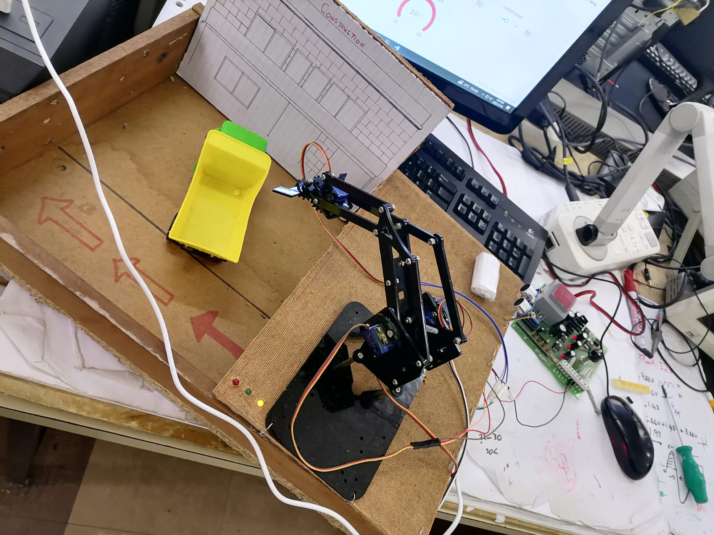
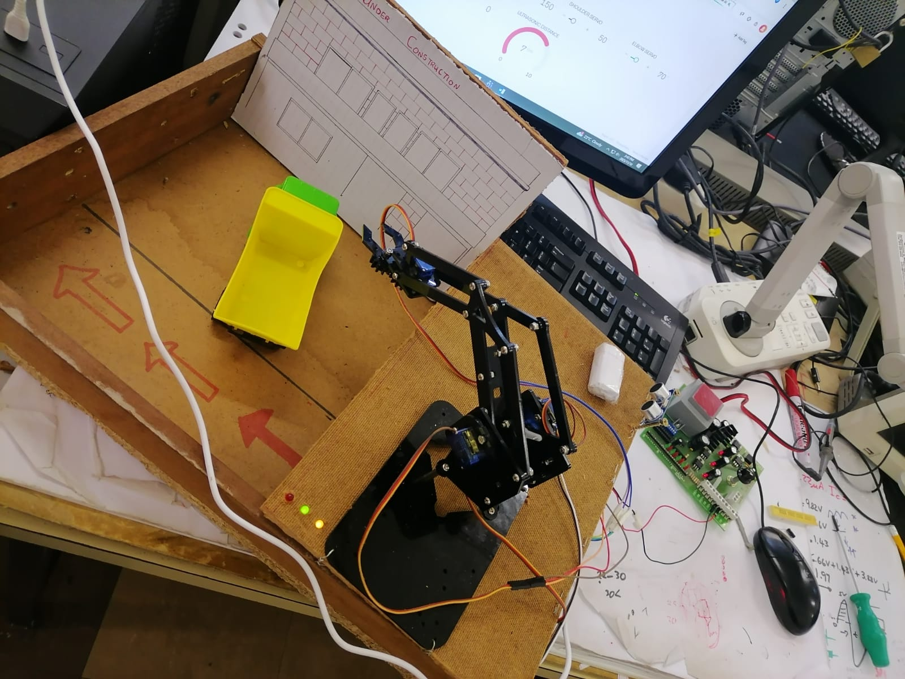

# Construction Site Robotic Arm

## Project Overview

An individual second-semester Electronic and Computer Engineering project focused on developing a robotic arm prototype for construction-site automation.

The system uses an ESP32 microcontroller to control a multi-servo robotic arm capable of detecting, picking and placing objects, with the aim of demonstrating automated material-handling applications in construction environments.

## Objective

The project aims to explore how embedded systems, robotics, sensors and wireless control can be integrated to automate repetitive material-handling tasks in construction environments.

## Technologies and Components

- ESP32 microcontroller
- HC-SR04 ultrasonic sensor
- SG90 servo motors
- Robotic arm mechanism
- Servo-controlled gripper
- Blynk IoT platform
- External 5V servo power supply

## System Features

- Object detection using an ultrasonic sensor
- Robotic arm movement using multiple servo motors
- Automated object picking and placement
- Servo-controlled gripper
- Manual control through a wireless interface
- ESP32-based embedded control
- Demonstration of construction automation concepts

## Servo Configuration

- Base servo: GPIO 13
- Shoulder servo: GPIO 12
- Elbow servo: GPIO 14
- Gripper servo: GPIO 27
- Ultrasonic trigger: GPIO 5
- Ultrasonic echo: GPIO 18

 ## My Role

This was an individual project completed during my second semester of Electronic and Computer Engineering.

I was responsible for the project concept, system design, hardware integration, programming, testing, troubleshooting and demonstration of the robotic arm.

## Engineering Skills Demonstrated

- Embedded Systems
- ESP32 Programming
- Robotics
- Servo Motor Control
- Sensor Integration
- IoT and Wireless Control
- Hardware Integration
- Automation
- System Troubleshooting
- Construction Technology Applications

## Project Significance

The project demonstrates the application of Electronic and Computer Engineering in construction automation by combining embedded systems, robotics, sensing and wireless technologies to explore automated material handling. 

## How the System Works

The Construction Site Robotic Arm operates by integrating sensing, wireless communication, embedded control and servo-based actuation.

The ESP32 functions as the main controller of the system. It receives control commands through the wireless interface and processes these commands to control the individual servo motors responsible for the movement of the robotic arm.

An HC-SR04 ultrasonic sensor is used for object detection and distance measurement. The robotic arm uses multiple servo motors to control the base, shoulder, elbow and gripper mechanisms.

The overall operating sequence consists of:

1. Detecting or identifying the construction material.
2. Positioning the robotic arm towards the material.
3. Moving the robotic arm to the required position.
4. Activating the gripper to grasp the material.
5. Lifting and transporting the material.
6. Positioning the material at the desired location.
7. Releasing the material using the gripper.

This demonstrates how embedded systems, sensing, wireless communication and robotic actuation can be integrated into an automated construction application.

## System Architecture

The system is based on an ESP32 microcontroller that coordinates sensing, wireless communication, decision-making and robotic movement.

The main system architecture consists of the following components:

- **ESP32 Microcontroller:** Central control unit responsible for processing sensor information, receiving commands and controlling the robotic arm.
- **HC-SR04 Ultrasonic Sensor:** Used for distance measurement and object detection. The sensor provides feedback to the ESP32 to determine when an object is within the required detection range.
- **Servo Motors:** Control the movement of the robotic arm, including the base, shoulder, elbow and gripper.
- **Wireless Communication:** Enables remote interaction and control of the robotic arm.
- **Blynk Platform:** Provides the user interface for sending control commands and interacting with the robotic arm.
- **External Power Supply:** Provides the required power for the servo motors to ensure stable operation.

### Automatic Pick-and-Place Process

The ultrasonic sensor is integrated into the automatic pick-and-place process. The sensor continuously measures the distance to the target object and provides feedback to the ESP32.

When an object is detected within the defined distance range, the ESP32 initiates the programmed sequence of robotic movements. The servo motors then coordinate the positioning of the arm, gripping of the object, movement to the designated location and release of the object.

The general system flow is:

**HC-SR04 Sensor → ESP32 → Decision Making → Servo Control → Robotic Arm Movement**

Wireless commands through the Blynk interface provide an additional method of interacting with the system.

The ESP32 therefore serves as the central interface between the sensing system, software control logic and physical robotic mechanism, enabling an automated construction-material handling process.

## Circuit and Wiring

The robotic arm uses an ESP32 as the main control unit. The ESP32 interfaces with the servo motors, HC-SR04 ultrasonic sensor and status LEDs.

### GPIO Configuration

| Component | ESP32 GPIO | Function |
|---|---:|---|
| Base Servo | GPIO 13 | Controls base rotation |
| Shoulder Servo | GPIO 12 | Controls shoulder movement |
| Elbow Servo | GPIO 14 | Controls elbow movement |
| Gripper Servo | GPIO 27 | Controls gripper opening and closing |
| HC-SR04 Trigger | GPIO 5 | Sends ultrasonic trigger pulse |
| HC-SR04 Echo | GPIO 18 | Receives ultrasonic echo |
| Auto Mode LED | GPIO 21 | Indicates automatic mode |
| Manual Mode LED | GPIO 22 | Indicates manual mode |
| Brick Detection LED | GPIO 23 | Indicates object detection |

### Power and Control

The ESP32 provides the control signals for the servo motors and sensor interfaces, while an external 5 V supply is used for the servo motors.

The servo motors are connected to the robotic arm's base, shoulder, elbow and gripper mechanisms. The HC-SR04 provides distance measurements to the ESP32, which uses the measured distance as part of the automatic pick-and-place decision process.

The system also uses three LEDs to provide visual feedback for the operating mode and object detection status.

## Software and Source Code

The robotic arm is programmed using the Arduino development environment with the ESP32 as the main microcontroller.

The software integrates wireless communication, sensor processing, servo control, operating-mode selection and the automatic pick-and-place sequence.

### Main Software Functions

- ESP32-based embedded control
- Blynk wireless communication
- Manual and automatic operating modes
- Servo motor control
- HC-SR04 distance measurement
- Automatic object detection
- Automatic pick-and-place sequence
- Real-time distance monitoring through the Blynk interface
- LED status indication

### Blynk Control

The Blynk interface is used to interact with the robotic arm remotely.

| Virtual Pin | Function |
|---|---|
| V0 | Automatic / Manual mode selection |
| V1 | Base servo control |
| V2 | Shoulder servo control |
| V3 | Elbow servo control |
| V4 | Gripper servo control |
| V5 | Distance monitoring |

### Source Code

The complete ESP32 source code is available in the `src` directory:

[View the ESP32 Source Code](./src/robotic_arm.ino)

## 13. Project Images

The following images document the physical construction, electronic integration and demonstration of the Construction Site Robotic Arm.

### Robotic Arm Development

### Hardware and Electronic Integration

### Robotic Arm Configuration

### Project Demonstration
 
