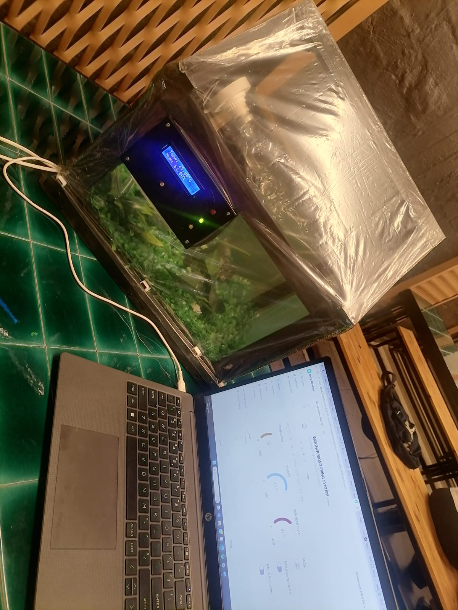
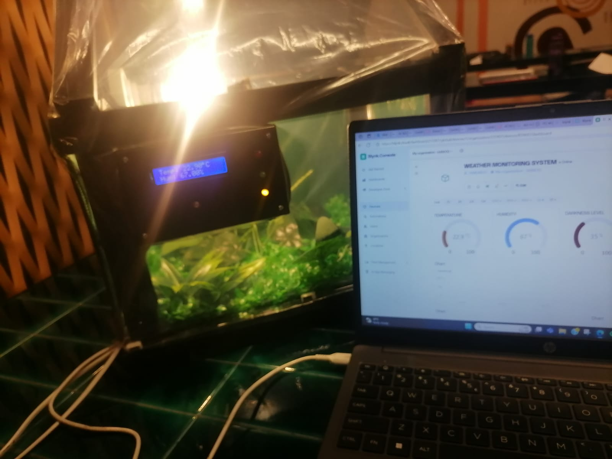
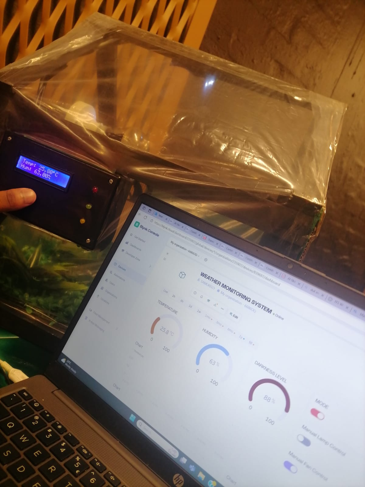
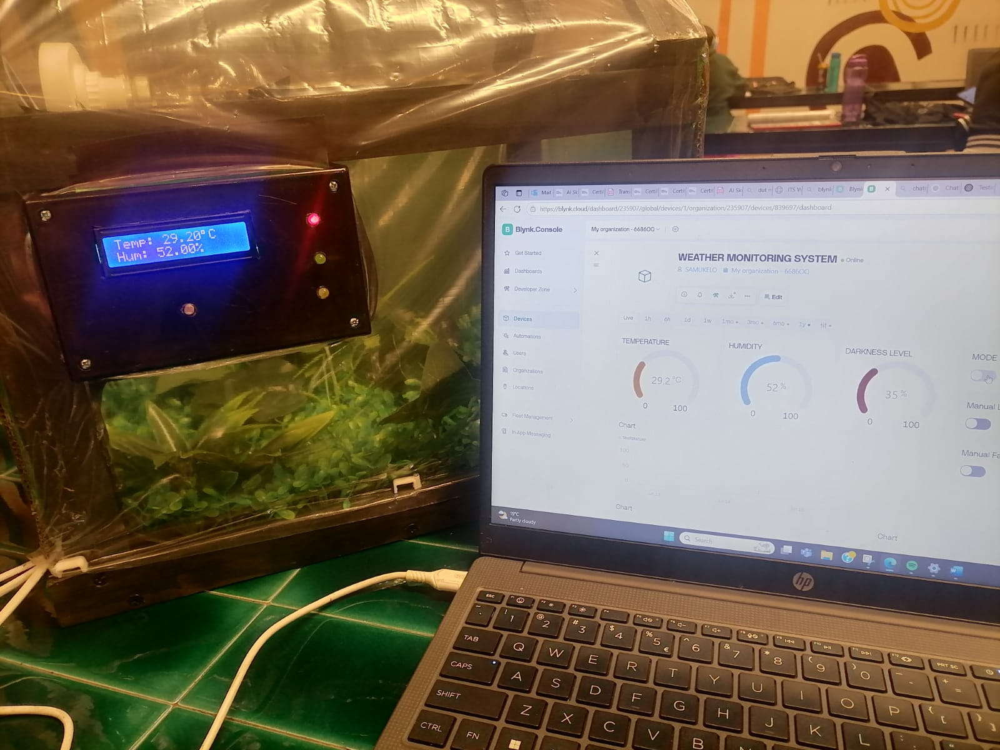
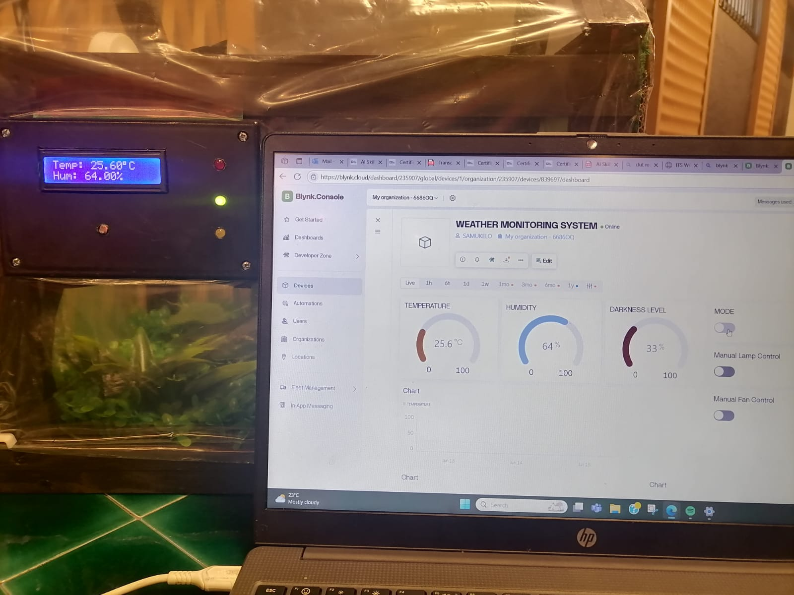
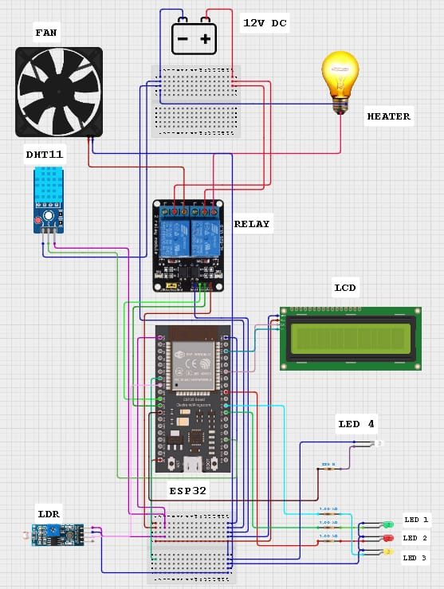
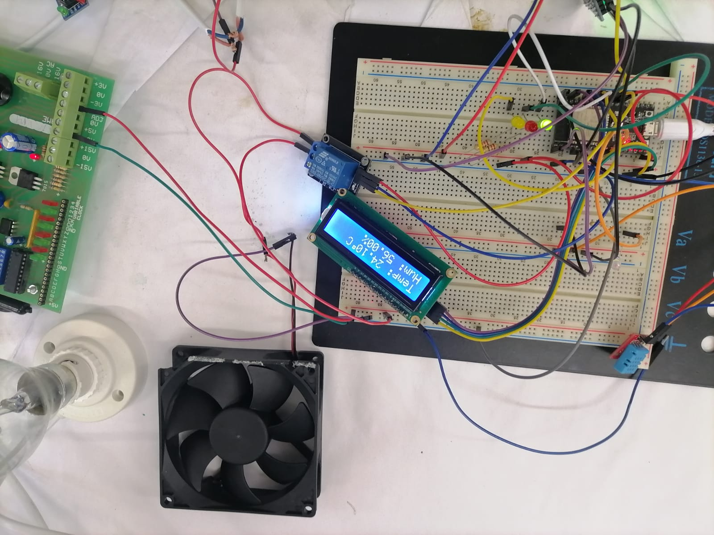
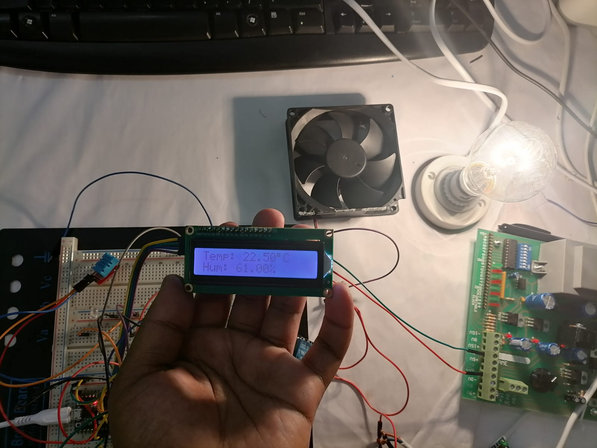
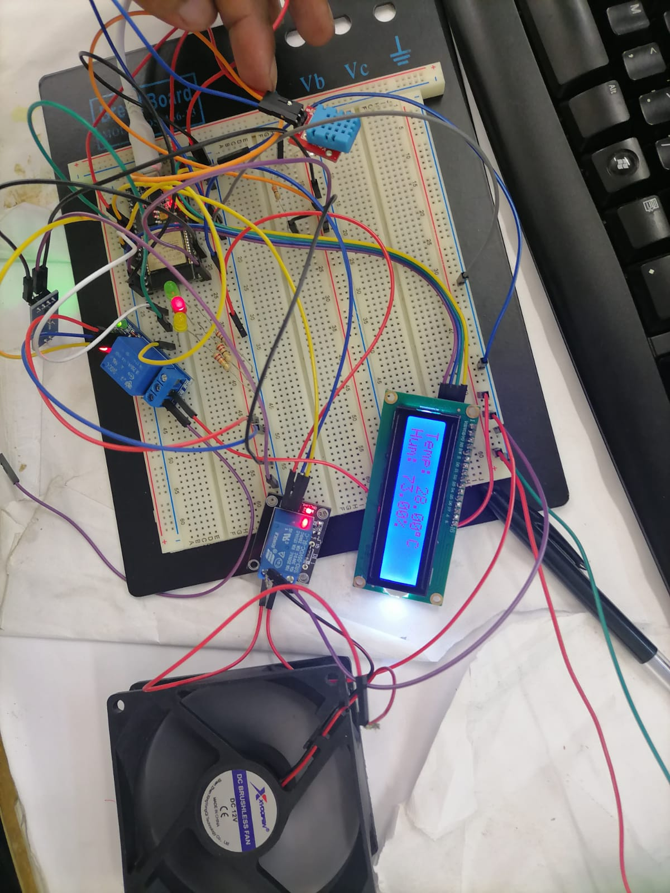
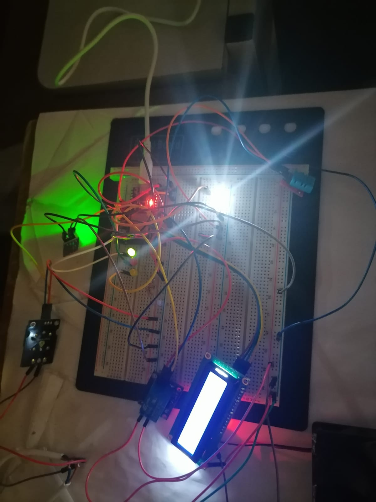

# Wireless Weather Monitoring System

## 1. Project Overview

The Wireless Weather Monitoring System is a group-based engineering project developed to monitor environmental conditions using an ESP32-based embedded system. The system integrates environmental sensors, wireless communication, local hardware outputs, and a cloud-based monitoring interface to provide real-time access to measured weather parameters.

The project demonstrates the practical application of embedded systems, Internet of Things (IoT) technologies, sensor interfacing, wireless communication, and remote monitoring. The collected environmental data is processed by the ESP32 and transmitted to a remote dashboard, allowing the monitored conditions to be observed without requiring direct physical access to the hardware.

The project was developed as part of the Electronic and Computer Engineering programme at Durban University of Technology (DUT), with the work carried out collaboratively as a group.

## 2. Project Objectives

The primary objective of the Wireless Weather Monitoring System was to develop an IoT-based platform capable of sensing, processing, and remotely monitoring environmental conditions in real time.

The project objectives were to:

- Design and implement an ESP32-based wireless weather monitoring system.
- Interface environmental sensors with the ESP32 to acquire real-time measurements.
- Monitor environmental parameters such as temperature, humidity, and light intensity.
- Transmit the collected sensor data wirelessly to a remote monitoring platform.
- Develop a user-friendly dashboard for displaying and monitoring the measured parameters.
- Implement automated control of connected outputs based on monitored environmental conditions.
- Demonstrate the practical integration of embedded systems, sensors, wireless communication, and IoT technologies.
- Test and evaluate the system to verify its functionality and reliability under practical operating conditions.
- Develop teamwork, technical problem-solving, system integration, and engineering project-management skills through collaborative implementation.

## 3. System Description

The Wireless Weather Monitoring System is an ESP32-based Internet of Things (IoT) platform designed to monitor environmental conditions and provide remote access to the collected data.

The system uses environmental sensors connected to the ESP32 to acquire real-time measurements. The ESP32 processes the sensor readings and communicates the data wirelessly to the monitoring platform. The collected information is presented through a digital dashboard, allowing users to monitor the environmental conditions remotely.

In addition to environmental monitoring, the system incorporates controllable outputs that respond to the monitored conditions. This demonstrates the integration of sensing, processing, wireless communication, remote monitoring, and automated control within a single embedded system.

The overall system can be divided into four main stages:

1. **Sensing** – Environmental sensors measure the required physical parameters.
2. **Processing** – The ESP32 receives and processes the sensor measurements.
3. **Wireless Communication** – The processed data is transmitted wirelessly to the monitoring platform.
4. **Monitoring and Control** – The dashboard displays the measured parameters and provides control and monitoring of connected outputs.

This architecture demonstrates how embedded hardware and IoT technologies can be combined to create a practical remote environmental monitoring solution.

## 4. System Architecture

The Wireless Weather Monitoring System follows a distributed IoT architecture in which environmental conditions are sensed locally, processed by an ESP32 microcontroller, and made available through a wireless monitoring interface.

The main system architecture consists of the following functional blocks:

- **Environmental Sensing:** A DHT11 sensor measures temperature and humidity, while an LDR is used to monitor ambient light intensity.
- **Processing and Control:** The ESP32 serves as the central controller, receiving sensor measurements, processing the data, and executing the programmed control logic.
- **Local Display:** A 16 × 2 I2C LCD provides local access to temperature and humidity measurements.
- **Wireless Communication:** The ESP32 connects to a Wi-Fi network and communicates with the Blynk IoT platform for remote monitoring and control.
- **Remote Monitoring:** The Blynk dashboard displays the measured temperature, humidity, and light-level information and provides user controls for the system.
- **Actuation:** Relay-controlled outputs are used to control a lamp and fan. The system can operate in automatic or manual mode.
- **Status Indication:** Indicator LEDs provide a visual representation of the temperature condition and lighting state.

### System Data Flow

The system operates according to the following general data flow:

**Environmental Conditions → Sensors → ESP32 → Wi-Fi → Blynk Dashboard**

At the same time, control commands can follow the reverse path:

**Blynk Dashboard → Wi-Fi → ESP32 → Relays / Outputs**

In automatic mode, the ESP32 uses programmed temperature thresholds to determine the appropriate system response. According to the implemented control logic, temperatures below 23 °C activate the lamp, temperatures between 23 °C and 28 °C represent the normal operating range, and temperatures above 28 °C activate the fan. The LDR measurement is also used to determine the ambient lighting condition and control the associated light indicator.

The system therefore combines sensing, embedded processing, wireless communication, remote monitoring, and automated actuation into a single IoT-based platform.

## 5. Hardware Components

The Wireless Weather Monitoring System was developed using an ESP32-based embedded platform together with environmental sensors, a local display, indicator LEDs, and relay-controlled outputs.

| Component | Function |
|---|---|
| **ESP32 Development Board** | Main microcontroller responsible for sensor acquisition, control logic, Wi-Fi communication, and interaction with the Blynk IoT platform. |
| **DHT11 Temperature & Humidity Sensor** | Measures ambient temperature and relative humidity. |
| **LDR (Light-Dependent Resistor)** | Measures ambient light intensity and provides an indication of bright or dark conditions. |
| **16 × 2 I2C LCD** | Displays temperature and humidity locally. |
| **Relay Module / Relay Outputs** | Provides switching control for the lamp and fan according to the programmed operating conditions or manual commands. |
| **Temperature Indicator LEDs** | Provide visual indication of the measured temperature range: below 23 °C, 23–28 °C, and above 28 °C. |
| **Light Indicator LED** | Indicates the detected ambient lighting condition based on the LDR measurement. |
| **Breadboard and Jumper Wires** | Used for prototyping, interconnecting, and testing the electronic components. |
| **Power Supply** | Provides the required electrical power to the ESP32 and connected circuit components. |

### Main ESP32 Connections

The implemented system uses the following documented ESP32 connections:

- **DHT11:** GPIO 4
- **LDR:** GPIO 34
- **Lamp Relay:** GPIO 17
- **Fan Relay:** GPIO 16
- **Light Indicator LED:** GPIO 27
- **Temperature Indicator LEDs:** GPIO 25, GPIO 18, and GPIO 5
- **LCD:** I2C interface at address `0x27`

These connections form the hardware interface between the ESP32, environmental sensors, display, indicators, and controlled outputs.

## 6. Software & Technologies

The Wireless Weather Monitoring System integrates embedded programming, wireless communication, cloud-based monitoring, and hardware control technologies to provide real-time environmental monitoring and automated control.

### 6.1 Programming and Development

- **Arduino IDE** – Used for programming and uploading firmware to the ESP32.
- **C/C++** – Used to develop the embedded control and monitoring logic.
- **ESP32 Libraries** – Used to interface with sensors, the LCD, LEDs, and relay-controlled devices.

### 6.2 Wireless Monitoring and Control

- **Blynk IoT Platform** – Used to provide wireless monitoring and remote control through a web-based dashboard.
- **Blynk Datastreams** – Used to exchange sensor readings and control commands between the ESP32 and the Blynk platform.

### 6.3 Embedded System Technologies

The software is responsible for:

- Reading temperature and humidity data from the DHT11 sensor.
- Monitoring ambient light levels using the LDR.
- Displaying environmental readings on the I2C LCD.
- Controlling the lamp and fan through relay outputs.
- Driving LED indicators according to the measured temperature and lighting conditions.
- Sending sensor data to the Blynk dashboard for remote monitoring.
- Receiving control commands from the Blynk dashboard.

Together, these technologies enable the system to combine environmental sensing, local processing, wireless communication, monitoring, and automated control within a single embedded platform.

## 7. Blynk & Web Dashboard

The Wireless Weather Monitoring System uses the Blynk IoT platform to provide remote monitoring and control of the system through a web dashboard.

The Blynk dashboard displays real-time environmental measurements obtained from the ESP32 and provides control interfaces for the connected actuators.

### Dashboard Functions

The implemented dashboard provides the following functionality:

- **Temperature Monitoring:** Displays the temperature measured by the DHT11 sensor.
- **Humidity Monitoring:** Displays the relative humidity measured by the DHT11 sensor.
- **Light-Level Monitoring:** Displays the ambient light condition detected by the LDR sensor.
- **Lighting Control:** Allows the connected lamp to be controlled remotely through the dashboard.
- **Fan Control:** Allows the connected fan to be controlled remotely.
- **System Indicators:** Provides visual indicators for the operating state of the lighting, fan, and temperature conditions.

The dashboard communicates with the ESP32 through the Blynk IoT platform, enabling wireless monitoring and control without requiring a direct physical connection to the hardware.

This interface demonstrates the integration of embedded hardware, wireless communication, cloud-based IoT services, and remote device control within the project. 

## 8. System Operation

The Wireless Weather Monitoring System operates by continuously collecting environmental data through sensors connected to the ESP32. The collected data is processed by the ESP32 and used to monitor and control the connected outputs.

The system operates according to the following sequence:

1. The **DHT11 sensor** measures the surrounding temperature and humidity.
2. The **LDR sensor** detects the surrounding light intensity.
3. The ESP32 processes the sensor readings and determines the required system responses.
4. The measured environmental conditions are displayed locally through the **I2C LCD**.
5. The sensor data is transmitted wirelessly to the **Blynk IoT platform**.
6. The Blynk dashboard provides real-time monitoring of the environmental conditions.
7. The connected **lamp and fan** can be controlled according to the programmed system logic and through the available dashboard controls.
8. LED indicators provide additional visual feedback regarding the operating conditions of the system.

This operating sequence allows the system to combine environmental sensing, local indication, wireless communication, and actuator control into a single embedded IoT solution. 

## 9. Source Code

The embedded firmware for the Wireless Weather Monitoring System was developed for the ESP32 using C/C++ and the Arduino development environment.

The source code implements the core functionality of the system, including:

- DHT11 temperature and humidity data acquisition.
- LDR-based ambient light monitoring.
- Local temperature and humidity display through the I2C LCD.
- Wireless communication with the Blynk IoT platform.
- Automatic temperature-based control of the lamp and fan.
- Manual control of the lamp and fan through the Blynk dashboard.
- Temperature and lighting status indication using LEDs.
- Processing and transmission of sensor data to the remote monitoring interface.

### Source Code File

The complete sanitized source code is available here:

**[View ESP32 Source Code](./src/weather_monitoring.ino)**

> **Note:** The published source code contains placeholders for Wi-Fi and Blynk credentials to prevent sensitive authentication information from being exposed in the public repository.

## 10. Testing & Results

The Wireless Weather Monitoring System was tested to verify the operation and integration of its main sensing, display, communication, and control functions.

### 10.1 Sensor Testing

The DHT11 sensor was used to obtain temperature and humidity measurements, while the LDR was used to monitor ambient light intensity. The ESP32 processed the sensor readings and made the information available to the local display and Blynk monitoring interface.

### 10.2 Display Testing

The 16 × 2 I2C LCD was tested to provide local feedback of the measured environmental conditions. Temperature and humidity readings were displayed on the LCD during system operation.

### 10.3 Wireless Monitoring

The ESP32 was configured to communicate with the Blynk IoT platform through Wi-Fi. Sensor measurements were transmitted to the dashboard for remote monitoring.

The following Blynk datastreams were implemented:

| Virtual Pin | Parameter / Function |
|---|---|
| **V0** | Temperature |
| **V1** | Humidity |
| **V2** | Light Level |
| **V3** | Automatic / Manual Mode |
| **V4** | Manual Bulb Control |
| **V5** | Manual Fan Control |

### 10.4 Automatic Control Testing

The automatic operating mode uses programmed temperature thresholds to control the connected outputs:

- **Below 23 °C:** Lamp activated and fan deactivated.
- **23–28 °C:** Lamp and fan deactivated.
- **Above 28 °C:** Fan activated and lamp deactivated.

Temperature indicator LEDs provide additional visual feedback for the different temperature ranges.

### 10.5 Manual Control Testing

The manual operating mode allows the user to control the lamp and fan through the Blynk dashboard. This provides an alternative to the automatic temperature-based control logic.

### 10.6 Overall System Integration

The testing process focused on verifying the interaction between the sensors, ESP32, LCD, Blynk platform, indicator LEDs, and relay-controlled outputs.

The implemented system demonstrates the integration of environmental sensing, embedded processing, wireless communication, remote monitoring, and automated/manual control within a single IoT platform.

## 11. Project Implementation, Testing and Demonstration

The Wireless Weather Monitoring System was assembled and tested to verify the integration of the environmental sensors, control outputs, local display, indicator LEDs, and wireless monitoring interface. The final prototype was evaluated under different environmental conditions to demonstrate its ability to monitor temperature, humidity, and light intensity and to respond automatically when the measured conditions moved outside the desired operating range.

### 11.1 Final Prototype and System Integration

The completed Wireless Weather Monitoring System integrates the ESP32 microcontroller with the DHT11 temperature and humidity sensor, LDR-based light detection, relay-controlled outputs, indicator LEDs, and an LCD display. The system also communicates with the Blynk platform, allowing the monitored parameters and selected control functions to be viewed remotely.

**Figure 11.1:** Final Wireless Weather Monitoring System prototype with the Blynk monitoring dashboard.

**Figure 11.2:** Final prototype operating alongside the Blynk monitoring interface.

**Figure 11.3:** Final prototype showing the LCD readings together with the Blynk environmental monitoring interface.

**Figure 11.4:** Final prototype demonstrating integrated environmental monitoring and control through the physical system and Blynk interface.

**Figure 11.5:** Final prototype demonstrating real-time temperature, humidity, and darkness-level monitoring through the LCD and Blynk dashboard.

These photographs demonstrate the integration of the hardware and software components into a functional wireless monitoring system. The LCD provides local feedback, while the Blynk interface provides remote access to the measured environmental parameters and control functions.

### 11.2 Hardware Wiring and Circuit Implementation

The hardware connections used to implement the system are shown in the circuit diagram below. The ESP32 serves as the central controller and interfaces with the DHT11 sensor, LDR, relay module, LCD, indicator LEDs, and controlled electrical loads.

**Figure 11.6:** ESP32-based circuit wiring diagram showing the connections between the controller, sensors, display, relay-controlled loads, and indicator LEDs.

The circuit diagram provides a documented representation of the hardware implementation and shows how the different components were interconnected to achieve environmental monitoring and automatic control.

### 11.3 Temperature Control Testing 

The temperature-control functionality was tested under three different operating conditions: temperature within the desired range, temperature below the desired range, and temperature above the desired range.

#### 11.3.1 Temperature Within the Desired Range

When the measured temperature falls within the predefined desired range, the system does not activate the heating or cooling output. The green indicator LED is used to indicate that the temperature is within the desired operating range.

**Figure 11.7:** Final prototype without housing showing temperature within the desired range and activation of the green temperature-status indicator LED.

This test demonstrates the normal operating condition of the temperature-control system.

#### 11.3.2 Temperature Below the Desired Range

When the measured temperature falls below the desired range, the system activates the lamp, which functions as the heating element. The purpose of this response is to increase the temperature towards the desired operating range.

**Figure 11.8:** Final prototype without housing demonstrating low-temperature operation, with the lamp activated as the heating element.

This test demonstrates the system's ability to automatically respond to a low-temperature condition.

#### 11.3.3 Temperature Above the Desired Range

When the measured temperature exceeds the desired range, the system activates the fan as a cooling element. At the same time, the red indicator LED is activated to provide a visual indication that the temperature is above the desired range.

**Figure 11.9:** Final prototype without housing demonstrating high-temperature operation, with the cooling fan and red temperature-status indicator activated.

This demonstrates the automatic cooling response and the use of the indicator LED to communicate the system's temperature status.

### 11.4 LDR Darkness Detection Testing

The LDR functionality was tested to verify the system's ability to detect changes in ambient light conditions.

**Figure 11.10:** Final prototype without housing demonstrating the LDR-based darkness detection function.

The test demonstrates the integration of the LDR with the ESP32 and confirms that changes in ambient light can be detected by the system and used as an input for the lighting-control functionality.

### 11.5 Overall System Demonstration

The photographs collectively demonstrate the progression from the hardware implementation and circuit configuration to the completed prototype, wireless monitoring interface, and functional testing.

The system demonstrates the ability to:

- Monitor temperature and humidity.
- Detect changes in ambient light using the LDR.
- Display measurements locally using the LCD.
- Transmit environmental measurements to the Blynk platform.
- Activate the heating element when the temperature falls below the desired range.
- Activate the cooling fan when the temperature rises above the desired range.
- Provide visual temperature-status indications using LEDs.
- Provide manual monitoring and control functionality through the Blynk interface.

Overall, the testing photographs provide practical evidence of the integration of sensing, embedded processing, wireless monitoring, indication, and automatic environmental control within a single functional prototype.

## 12. Individual Role and Contribution

This project was completed as a group project, with responsibilities shared among the team members. As a member of the project team, I contributed to the technical development, integration, testing, and presentation of the Wireless Weather Monitoring System.

### My Responsibilities

My individual contributions included:

- Contributing to the design and development of the ESP32-based weather monitoring system.
- Assisting with the integration of the DHT11 temperature and humidity sensor and LDR for environmental monitoring.
- Contributing to the implementation of the automatic temperature-control logic.
- Assisting with the integration and testing of the relay-controlled lamp and fan.
- Contributing to the integration of the LCD and LED indicators for local system feedback.
- Assisting with the configuration and testing of the Blynk IoT monitoring and control interface.
- Participating in system testing under different temperature and lighting conditions.
- Contributing to troubleshooting, debugging, and resolving hardware and software integration challenges.
- Participating in the preparation of the project documentation and final presentation.
- Contributing to the demonstration of the completed system and explaining its operation.

### Skills Demonstrated

Through my contribution to the project, I developed and demonstrated practical skills in:

- ESP32 embedded systems development
- IoT and wireless communication
- Sensor interfacing
- Relay and actuator control
- LCD and LED interfacing
- Blynk IoT platform configuration
- Embedded C/C++ programming
- Hardware and software integration
- System testing and troubleshooting
- Technical documentation
- Teamwork and engineering project collaboration

## 13. Project Documentation

The project documentation provides detailed information about the design, implementation, testing, individual contribution, and presentation of the Wireless Weather Monitoring System.

All supporting documents are available in the `docs` folder.

### 13.1 Group Final Report

The group final report provides a comprehensive record of the Wireless Weather Monitoring System, including the project objectives, system design, implementation, testing, results, and conclusions.

**[View Group Final Report](./docs/GrpH_Final%20Report.pdf)**

### 13.2 Individual Task Report

The individual task report documents my specific contribution to the group project and provides additional details regarding the individual work completed as part of the system development.

**[View Individual Task Report](./docs/GrpH_SheziSN_Final%20Report.pdf)**

### 13.3 Group Final Presentation 

The group final presentation summarises the Wireless Weather Monitoring System, including its objectives, system design, implementation, testing, results, and overall project outcomes.

**[View Group Final Presentation](./docs/GrpH_Final%20Pres.pdf)**

### 13.4 Individual Final Presentation

The individual final presentation provides an overview of my personal contribution to the project and the technical aspects of the work completed.

**[View Individual Final Presentation](./docs/GrpH_SheziSN_Final%20Pres.pdf)**

These documents provide additional technical and academic evidence supporting the development and implementation  of the Wireless Weather Monitoring System. 
